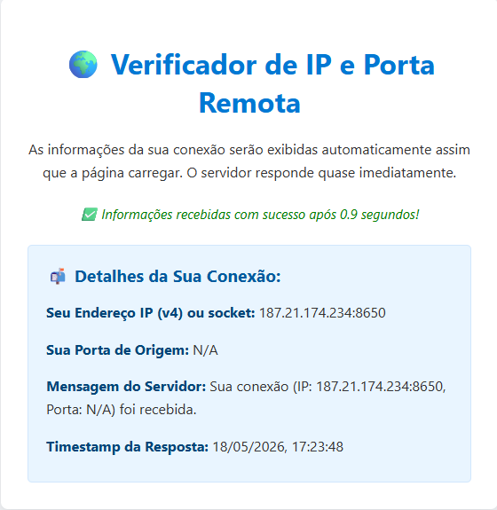
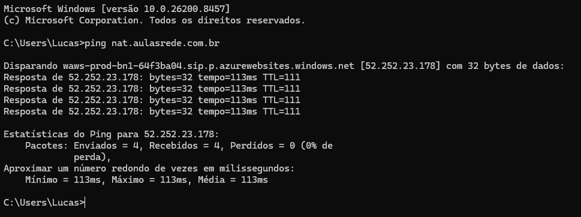
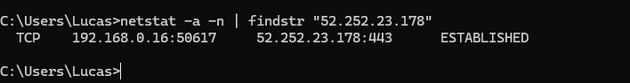
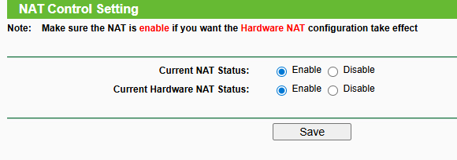
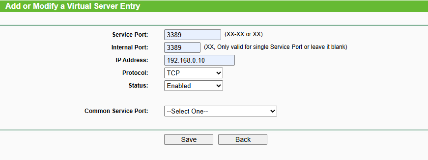

# Roteiro de Atividade – NAT (Network Address Translation)

## 1) Objetivos de Aprendizagem
- Compreender o que é NAT, seus tipos e por que ele é usado em redes.
- Identificar como sockets (IP:porta) mudam antes e depois da tradução.
- Observar, na prática, a ação de **PAT/NAPT** (tradução por porta) em conexões de saída.
- Configurar uma **regra de encaminhamento de portas (DNAT/Port Forwarding)** em um roteador doméstico simulado.
- Registrar evidências e documentar mapeamentos NAT.

---

## 2) Resumo Teórico: Como o NAT Funciona

### 2.1 O problema que o NAT resolve  
- Escassez de endereços IPv4 e necessidade de **compartilhar um único IP público** entre vários dispositivos internos.  
- Ocultação/isolamento parcial da rede interna (efeito colateral útil para segurança).

### 2.2 Conceitos fundamentais  
- **Endereços privados** (RFC 1918): não roteáveis na Internet (ex.: 192.168.0.0/16).  
- **IP público**: endereços roteáveis na Internet, atribuídos por ISPs.  
- **Socket**: par `IP:porta` que identifica uma extremidade de conexão TCP/UDP.  
- **Tabela de tradução NAT**: mapeia sockets “internos” ↔ “públicos”.

### 2.3 Tipos de NAT (visão prática)
- **SNAT (Source NAT)**: altera o **IP de origem** (geralmente de privado → público) em **conexões de saída**.  
- **DNAT (Destination NAT / Port Forwarding)**: altera o **IP/porta de destino** para alcançar um host **interno** a partir da Internet (acessos de entrada).  
- **PAT / NAPT (Port Address Translation)**: múltiplos clientes internos compartilham **um único IP público**, diferenciados por **portas de origem traduzidas** (também chamado “NAT Overload”).

### 2.4 Exemplo (tráfego de saída – PAT/NAPT)
```
Antes do NAT (LAN)             Roteador NAT                Internet
192.168.0.20:53124  ──►  200.100.50.10:49152  ──►  203.0.113.80:443
          origem:porta         origem:porta                     destino:porta
```
- O host interno (192.168.0.20:53124) tem seu **socket de origem** traduzido para (200.100.50.10:49152).  
- A tabela NAT registra esse mapeamento para que as **respostas** voltem ao cliente correto.

### 2.5 Exemplo (tráfego de entrada – DNAT/Port Forwarding)
```
Internet         Roteador NAT (regra DNAT)          Host Interno
x.y.z.w:3389  ──► 200.100.50.10:3389 ──► 192.168.0.10:3389
```
- Uma porta do IP público (3389/TCP) é **encaminhada** para um host interno específico (192.168.0.10:3389).

### 2.6 Benefícios e limitações  
**Benefícios**  
- Conserva IPv4; facilita compartilhamento do acesso; adiciona uma camada de “ofuscação” da topologia interna.  

**Limitações/efeitos colaterais**  
- Complica conexões **inbound** (é preciso DNAT/port forwarding).  
- Pode exigir **ALGs**/recursos especiais para aplicativos P2P, VoIP, IPSec.  
- **CGNAT** (Carrier-Grade NAT no provedor) pode impedir **port forwarding** no roteador do cliente.

> **Nota sobre CGNAT:** Se o seu IP “público” no roteador não for roteável na Internet (ou mudar após reboot/duplo NAT), você pode estar atrás de CGNAT do ISP. Nesse cenário, acessos de entrada pela Internet **não** funcionarão apenas com port forwarding local.

---

## 3) Pré-requisitos e materiais
- Computador com acesso à Internet e navegador.
- Terminal/shell com utilitários:
  - **Windows:** `ping`, `nslookup` (ou `Resolve-DnsName`), `netstat`/`Get-NetTCPConnection`, `findstr`.
  - **Linux/macOS:** `ping`, `dig`/`nslookup`, `ss`/`netstat`, `grep`.
- Emulador de roteador **TP-Link AC1750** (fornecido no enunciado/orientação da aula).

---

## 4) Atividade 1 — Observando a Tradução NAT (Saída)

### 4.1 O que você deve fazer
1. Acesse, a partir do seu computador local, o endereço:  
   **https://nat.aulasrede.com.br**  
   > A página mostrará o **IP público** da sua conexão e a **porta** após a tradução pelo NAT (PAT/NAPT).



2. Obtenha o **IP do host** `nat.aulasrede.com.br` (o servidor de destino) usando:
   - **Windows (CMD/PowerShell):**  
     - `ping nat.aulasrede.com.br`  
     - `nslookup nat.aulasrede.com.br`  
   - **Linux/macOS:**  
     - `ping -c 1 nat.aulasrede.com.br`  
     - `dig +short nat.aulasrede.com.br` ou `nslookup nat.aulasrede.com.br`



3. **Liste as conexões** do seu host filtrando pelo IP do servidor (obtido no passo 2):
   - **Windows (CMD):**  
     `netstat -a -n | findstr "x.y.z.w"`  
   - **Windows (PowerShell):**  
     `Get-NetTCPConnection | Where-Object {$_.RemoteAddress -eq "x.y.z.w"}`
   - **Linux/macOS:**  
     `ss -tuna | grep x.y.z.w`  
     *(ou)* `netstat -tuna | grep x.y.z.w`



4. Identifique, nas saídas, o **socket local antes do NAT** (no seu host) e o **socket público após o NAT** (mostrado no site). Observe a **mudança de porta de origem**.
    - Socket local: 192.168.0.16:50617
    - Socket público: 187.21.174.234:8556
    - Mudança da porta: Passou da porta 50617 para a porta 8556

### 4.2 O que você deve entregar
- **Print 1:** tela do site **nat.aulasrede.com.br** mostrando IP/porta **após** o NAT.  
- **Print 2:** saída do comando de listagem de conexões (netstat/ss) **filtrada** pelo IP do servidor de destino.  
- **Tabela das associações NAT**, seguindo o modelo a seguir:

#### Modelo de Tabela – Associações NAT

| Associação NAT | Socket antes do NAT (local) | Socket após o NAT (público) | Destino |
|---|--------------------|-------------------------|-------------------|
| 1 | 192.168.0.16:50617 | **187.21.174.234:8556** | 52.252.23.178:443 |


> **Dica:** o “antes do NAT” é o **socket local** visto pelo seu sistema (LAN); o “após o NAT” é o **socket público** exibido no site.

---

## 5) Atividade 2 — DNAT/Port Forwarding no Emulador TP-Link AC1750

### 5.1 O que você deve fazer
1. Acesse o [**Emulador AC1750**](https://emulator.tp-link.com/Archer_C7/Index.htm).  
2. Localize a opção **NAT** e verifique se está **habilitada**.  
   - **Print (1):** capture a tela que comprova a configuração.



3. Em **Forwarding** → **Virtual Server**, crie uma **regra de NAT estática (DNAT/Port Forwarding)** para permitir acesso externo via **RDP (Remote Desktop Protocol)** ao host **192.168.0.10**.  
   - **Protocolo/Porta do RDP:** **TCP 3389**.  
   - Sugestões de preenchimento:  
     - **Service Port (External/Public):** 3389  
     - **Internal IP:** 192.168.0.10  
     - **Internal Port:** 3389  
     - **Protocol:** TCP  
     - **Status/Enable:** Ativado

4. **Print (2):** capture a tela mostrando a **regra criada**.



### 5.2 Boas práticas (recomendado)
- **Reserva de DHCP** para 192.168.0.10 (o IP do host interno não deve mudar).  
- Alterar a **porta externa** (ex.: 53389 → 3389 interno) pode reduzir varreduras automatizadas.  
- Aplicar **restrição de origem** (quando disponível) e **senhas fortes/MFA** no serviço de destino.  
- **UPnP:** manter **desativado**, salvo necessidade explícita.  
- **CGNAT:** se o seu ISP usa CGNAT, o port forwarding pode **não** ser alcançável a partir da Internet pública.

### 5.3 O que você deve entregar
- **Print (1):** NAT habilitado no emulador.  
- **Print (2):** tela da regra de **Virtual Server** para RDP em 192.168.0.10.

---

## 6) Checklist para  Entrega via TEAMS (Consolidado) 
- [x] **Atividade 1 – Print do site** com IP/porta após NAT.  
- [x] **Atividade 1 – Print** do netstat/ss filtrando o IP do servidor.  
- [x] **Atividade 1 – Tabela** de associações NAT (modelo acima).  
- [x] **Atividade 2 – Print (1)**: NAT habilitado no emulador AC1750.  
- [x] **Atividade 2 – Print (2)**: regra de DNAT/Port Forwarding para RDP.

---

## 7) Dicas de Troubleshooting
- **Sem saída no netstat/ss?** Gere tráfego abrindo/atualizando a página do site e rode o comando novamente.  
- **Portas efêmeras diferentes?** É esperado: o NAT pode escolher portas distintas para cada conexão (PAT).  
- **Não encontro o IP do servidor?** Use `nslookup`/`dig` para resolver `nat.aulasrede.com.br`.  
- **Acesso externo não funciona (Atividade 2)?**  
  - Verifique se a **regra está ativa** e se o **serviço RDP está ouvindo** em 192.168.0.10:3389.  
  - Confirme se o **IP público do roteador** é realmente público (não CGNAT).  
  - Cheque **firewall** do host interno e regras do roteador (WAN → LAN).

---

## 8) Glossário Rápido
- **NAT:** Tradução de endereços de rede (IPv4).  
- **SNAT:** Tradução do endereço **de origem** (saída).  
- **DNAT / Port Forwarding:** Tradução do endereço/porta **de destino** (entrada).  
- **PAT/NAPT:** Tradução por **porta** para múltiplos clientes com um único IP público.  
- **ALG:** Adaptador de camada de aplicação (ex.: SIP-ALG).  
- **CGNAT:** NAT de grande porte no provedor (ISP), compartilhando IP público entre clientes.

---
